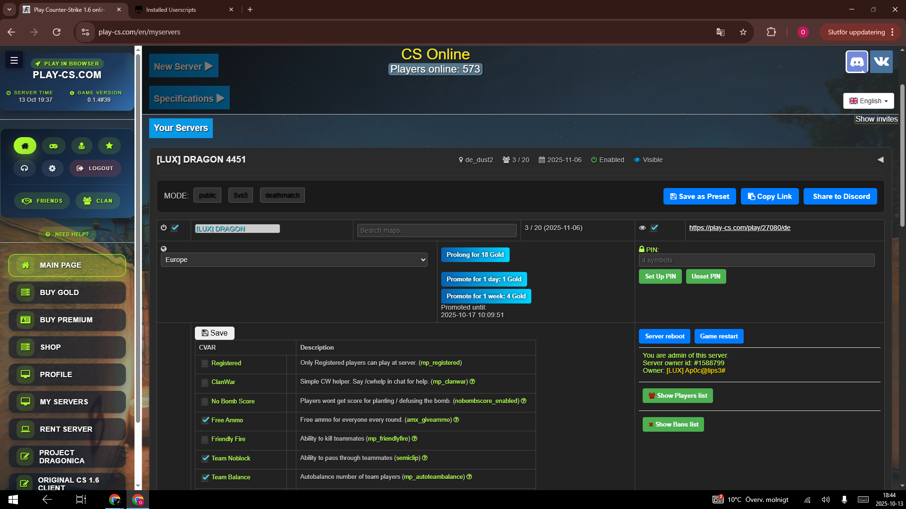

# CS Server Manager (Tampermonkey Script)

**Transform your play-cs.com/myservers page into a powerful, organized server management hub.**

This Tampermonkey script provides a complete overhaul of the server management interface on [play-cs.com/myservers](https://play-cs.com/myservers). It replaces the standard table layout with a modern, collapsible card system, adding numerous quality-of-life features designed to make managing your Counter-Strike servers more efficient and enjoyable.

## ✨ Features

*   **Collapsible Server Cards:** Each of your servers is displayed as an individual card. Click the header to expand or collapse it, revealing or hiding detailed settings.
*   **Per-Server Controls:**
    *   Edit server name, enable/disable, and public/private status directly.
    *   Adjust individual CVar settings.
    *   View real-time status updates in the card header (e.g., Enabled/Disabled, Visible/Hidden, current map).
*   **Configuration Presets:**
    *   Quickly apply predefined settings for common game modes like "Public," "5vs5," and "Deathmatch" with a single click.
    *   Automatically sets relevant checkboxes and CVars according to the chosen preset.
*   **Discord Integration:**
    *   Share your server's name, map, PIN, and join link directly to a Discord channel via webhook.
    *   Configure your webhook URL easily through a dedicated modal (Alt+Shift+D to open).
*   **Searchable Map Dropdowns:** No more endless scrolling! Find your desired map instantly with a search input integrated into the map selection dropdown.
*   **Improved UI/UX:**
    *   Sleek, dark-themed design for better readability and a consistent look.
    *   Collapsible "New Server" and "Specifications" sections to keep the page tidy.
    *   Global Save button is relocated and made more prominent.
*   **Server Owner Lookup:** Automatically fetches and displays the username of the server owner when only an ID is provided in the admin notice.
*   **Fixed Server Links:** Corrects malformed server join links to ensure they always work.
*   **Toast Notifications:** Provides subtle, non-intrusive pop-up messages for actions like saving webhooks or sharing servers.
*   **Dynamic Header Updates:** Server card headers update instantly when you change the server name, enabled/public status, or map.

## ✨ What's New in V3?

Version 3 introduces significant enhancements focused on customization, convenience, and a more polished user experience:

*   **Custom Presets:** You can now save your own server configurations as presets!
    *   Click the **"Save as Preset"** button to name and save your current setup.
    *   Quickly apply your custom presets from the "MODE" selector.
    *   Delete custom presets you no longer need with a single click.
*   **Copy Server Info:** A new **"Copy Link"** button allows you to instantly copy the server's join link and PIN to your clipboard, making it easier than ever to share with friends.
*   **UI Enhancements:**
    *   Action buttons ("Save as Preset," "Copy Link," "Share to Discord") now include icons for better visual identification.
    *   The overall design has been refined for a cleaner and more intuitive interface.
*   **Under-the-Hood Improvements:** The script has been refactored for better performance, stability, and easier future updates.

## 🚀 Installation

1.  **Install a UserScript Manager:** If you don't have one already, install a browser extension like [Tampermonkey](https://www.tampermonkey.net/) (recommended for Chrome, Edge, Safari, Opera, Firefox).
2.  **install the Script:**
    *   Navigate to the script file in this repository (`v3.user.js`).
    *   Click the **"Raw"** button at the top right of the file viewer.
    *   Tampermonkey will automatically open a new tab and ask you to confirm the installation.
    *   Click **"Install"**.
3.  **Navigate to Play-CS:** Go to [https://play-cs.com/myservers](https://play-cs.com/myservers). The page should now be transformed!

## ⚙️ Usage

1.  **Collapsible Cards:** Click on a server's header to expand its detailed controls and settings. Click again to collapse.
2.  **Presets:** Within an expanded server card, select a radio button (Public, 5vs5, Deathmatch) in the "MODE" section to apply predefined settings.
3.  **Search Maps:** When editing a server's map, click on the map dropdown and start typing to filter the options.
4.  **Share to Discord:**
    *   Expand the server card you want to share.
    *   Click the "Share to Discord" button.
    *   **First time:** You'll be prompted to enter your Discord webhook URL. You can also open this modal anytime by pressing `Alt + Shift + D`.
    *   Once configured, server details will be sent to your Discord channel.
5.  **Global Save:** The "Save Changes" button at the bottom of the page still functions as usual to save all modifications.

## ⚠️ Important Notes

*   This script modifies the appearance and functionality of the `play-cs.com/myservers` page.
*   All changes made via the script's UI are applied to the actual input fields on the page. Remember to click the **"Save Changes"** button (at the bottom) to make your modifications permanent on the Play-CS platform.
*   The Discord webhook URL is stored securely by your Tampermonkey extension using `GM_setValue`.

## 🤝 Contribution / Feedback

Feel free to open an issue or suggest improvements if you have any ideas or encounter bugs!

---
