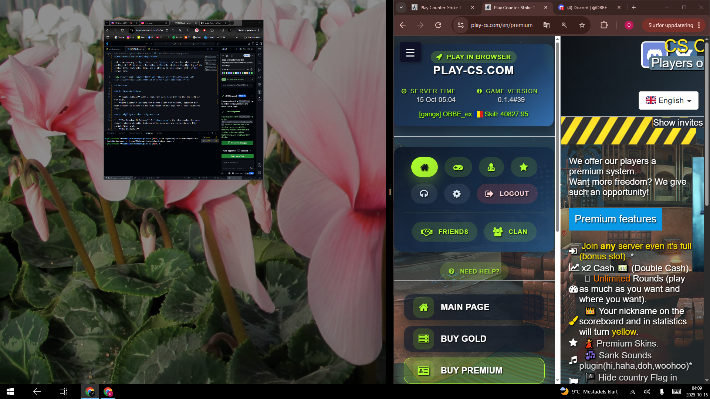

# New Sidebar Script for play-cs.com

This Tampermonkey script enhances the `play-cs.com` website with several quality-of-life features, including a hideable sidebar, highlighting of the active lobby navigation item, and a display of your player stats on the server card.

## Features

### 1. Hideable Sidebar

*   **Toggle Button:** Adds a hamburger menu icon (☰) to the top-left of the page.
*   **More Space:** Clicking the button hides the sidebar, allowing the main content to expand to the full width of the page for a less cluttered view.

### 2. Highlight Active Lobby Nav Item

*   **The Problem It Solves:** On `play-cs.com`, the side navigation menu doesn't always visually indicate which page you are currently on. This script fixes that.
*   **How It Works:**
    *   It intelligently compares the current page's URL with the navigation links.
    *   It handles different URL formats (relative, absolute, and language-specific paths).
    *   It adds the `lobby3-side-nav__item--active` class to the current page's link, which highlights it using the site's own styling.
    *   It dynamically updates the highlight as you navigate through the site.

### 3. Player Info on Server Card

*   **Quick Stats:** Fetches your player stats and displays them directly on the server card in the lobby.
*   **Information Displayed:** Shows your username, flag, and skill level.
*   **Performance:** The script is optimized for speed. It finds your Player ID directly from the lobby page and caches it, so your stats load almost instantly.

## Benefits

*   **Improved User Experience:** A cleaner interface with more space and at-a-glance information.
*   **Enhanced Navigation:** Easily see which section of the lobby you are in.
*   **Seamless Integration:** The script's features feel like a native part of the website.
