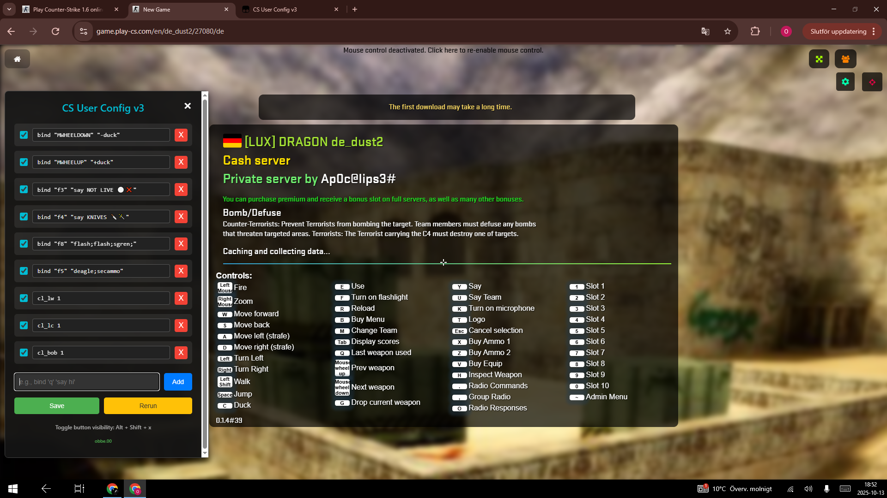
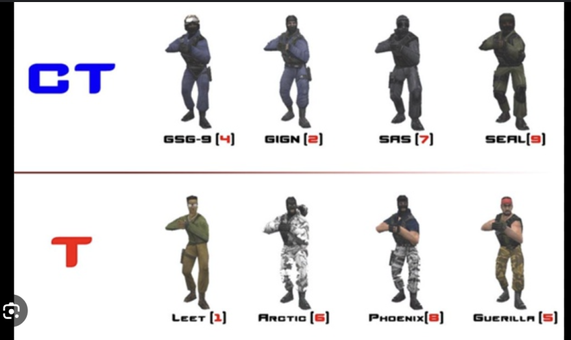

# CS User Config v3 (Latest - Install This)

Automatically executes a set of commands when you join a server, providing a convenient in-game UI to add, edit, enable, or disable your custom commands.

**📌 Installation File: `v3.user.js`**

 

## Features

*   **Automatic Execution**: Configured commands run automatically when you join a server.
*   **Modern UI**: A sleek, floating gear icon opens a modal window for managing commands.
*   **Interactive Management**: The modal allows for:
    *   Adding new commands
    *   Editing existing commands
    *   Enabling/disabling commands individually
    *   Saving your configuration
    *   Manually re-running all enabled commands
*   **Persistent Storage**: Your command list is saved using Tampermonkey's storage, so it persists across browser sessions.
*   **Default Commands**: Comes pre-loaded with useful binds (e.g., scroll wheel jump/duck, quick chat messages, weapon binds, display settings).
*   **Developer Friendly**: Designed for easy extension and modification by users.

## Installation

1.  **Install Tampermonkey**: If you don't have it already, install the Tampermonkey browser extension for your browser:
    *   [Chrome](https://chrome.google.com/webstore/detail/tampermonkey/dhdgffkkebhmkfjojejmpbldmpobfkfo)
    *   [Firefox](https://addons.mozilla.org/en-US/firefox/addon/tampermonkey/)
    *   [Edge](https://microsoftedge.microsoft.com/addons/detail/tampermonkey/iikmkjmpbldmmepgdkmfapfmccihdgpb)
    *   [Opera](https://addons.opera.com/en/extensions/details/tampermonkey-beta/)
2.  **Create a New User Script**:
    *   Click on the Tampermonkey icon in your browser toolbar.
    *   Select "Create a new script...".
3.  **Paste the Script**: Delete any existing code in the new script editor and paste the entire content of `v3.user.js` into it.
4.  **Save**: Save the script (usually by pressing `Ctrl + S` or `File > Save`).

## How to Use

1.  **Join a Play-CS.com Server**: Navigate to `https://game.play-cs.com/` and join any server.
2.  **Automatic Execution**: Once you're in the game and the chat input appears, the script will automatically execute all currently enabled commands.
3.  **Open the Menu**: Click the floating **gear icon** (⚙️) on the top right of the screen to open the "CS User Config" menu.
    *   If you're in pointer-lock mode (first-person view), the script will automatically exit pointer-lock to allow interaction with the menu.
4.  **Toggle Icon Visibility**: If the gear icon is in your way, press `Alt + Shift + X` to hide or show it.
5.  **Manage Commands**:
    *   **Enable/Disable**: Use the checkboxes next to each command to enable or disable it.
    *   **Edit**: Click directly on a command's text field to modify it.
    *   **Add New**: Type a command into the "New command" input field and click "Add".
    *   **Remove**: Click the "X" button next to a command to delete it.
5.  **Save Configuration**: After making changes, click "Save Configuration" to save your current list of commands and their enabled states. These will be loaded automatically next time you play.
6.  **Rerun Commands**: Click "Rerun Commands" to immediately execute all currently enabled commands again (useful for applying changes without rejoining).

## Default Commands Included

*   `bind "MWHEELDOWN" "-duck"`
*   `bind "MWHEELUP" "+duck"`
*   `bind "f3" "say NOtt LIVE ⚪❌"`
*   `bind "f4" "say KNIVES 🔪🗡️"`
*   `bind "f8" "flash;flash;sgren;"`
*   `bind "f5" "deagle;secammo"`
*   `cl_lw 1`
*   `cl_lc 1`
*   `cl_bob 0`

## Troubleshooting

*   **Menu not appearing**: Ensure Tampermonkey is enabled for `play-cs.com`. Check your browser's console (`F12`) for any errors.
*   **Commands not executing**: Make sure you are in an actual server where the chat input box is visible. The script waits for the game UI to appear.
*   **Keybinds not working outside menu**: If you have the menu open, make sure you click outside of the menu or click the gear icon again to close it and re-enable pointer lock/game controls.
*   **Commands not saving**: Ensure you click "Save" after making changes. Check Tampermonkey's storage for `cs_user_config_commands_v3`.

## Contribution

This script was initially created by `tiger3homs` (aka `obbe.00` on Discord) and was significantly refactored and improved in v3. Feel free to fork, modify, and suggest improvements!

 

## Other Commands 

blood "0"
canvas_width "100"
chat_enable "1"
cl_bobcycle "0.8"
cl_crosshair_color "0 0 0"
cl_crosshair_size "small"
cl_crosshair_translucent "1"
cl_dynamiccrosshair "0"
cl_minmodels "0"
cl_weather "0"
country_hide "1"
ct_model "5"
decals "0"
feedback "1"
fireinhole "1"
fps_max "150"
gamma "5"
grenadechat_enable "1"
hand2 "1"
hud_centerid "1"
inverted-mouse "0"
knife_model "14"
m_pitch "0.022"
minmodels "0"
motd_enable "1"
mp_decals "1"
name "OBBE_ex"
net_optimization "0"
notifications "1"
r_drawviewmodel "1"
sensitivity "1.49"
sensivity "3"
statsx_enable "1"
stretch_canvas "1"
switch_sound "0"
tr_model "5"
vid_mode "23"
voice_chat_off "0"
volume "0.2"
wheel_jump_everywhere "1"
zoom_sensitivity_ratio "1.2"
_cl_autowepswitch "0"
cl_min_t 6
cl_min_ct 2
cl_minmodels 1

***

`
